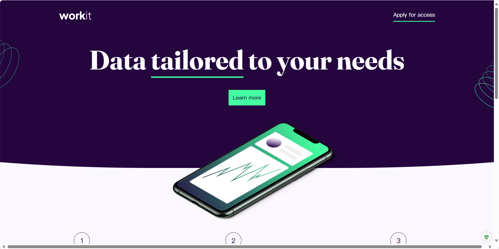

# Frontend Mentor - Workit landing page solution

This is a solution to the [Workit landing page challenge on Frontend Mentor](https://www.frontendmentor.io/challenges/workit-landing-page-2fYnyle5lu). Frontend Mentor challenges help you improve your coding skills by building realistic projects. 

## Table of contents

- [Overview](#overview)
  - [The challenge](#the-challenge)
  - [Screenshot](#screenshot)
  - [Links](#links)
  
- [My process](#my-process)
  - [Built with](#built-with)
  
- [Author](#author)

  

## Overview

### The challenge

Users should be able to:

- View the optimal layout for the interface depending on their device's screen size
- See hover and focus states for all interactive elements on the page

### Screenshot

### Links

- Solution URL: [github](https://github.com/lidamaomao/workit-landing-page)
- Live Site URL: [Add live site URL here](https://your-live-site-url.com)

## My process

### Built with

- Flexbox

- [React](https://reactjs.org/) - JS library

- UnoCSS

  

## Author

- Website - [李大猫的小站](https://www.lidamao.top)
- Frontend Mentor - [@lidamaomao](https://www.frontendmentor.io/profile/lidamaomao)
